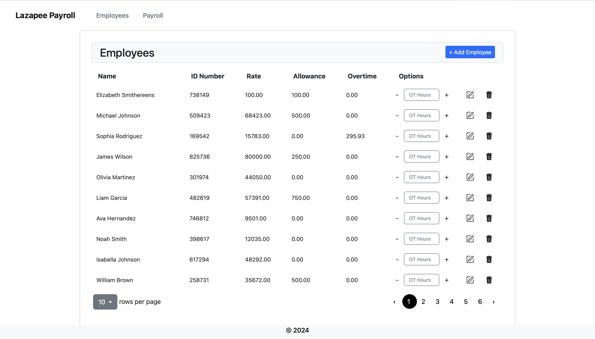
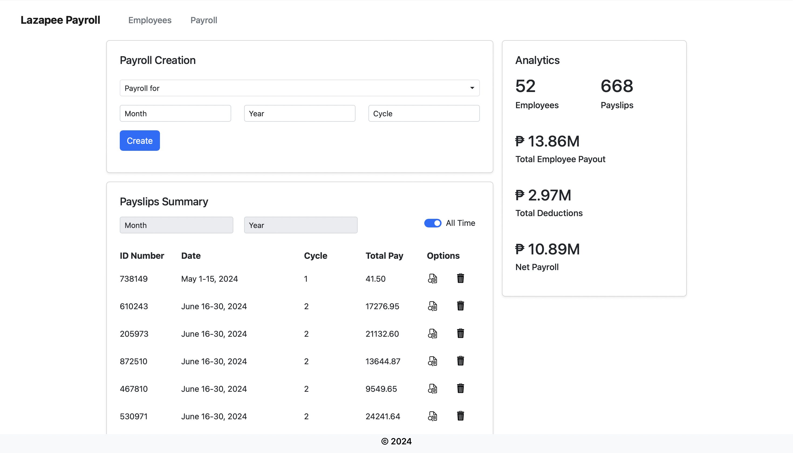
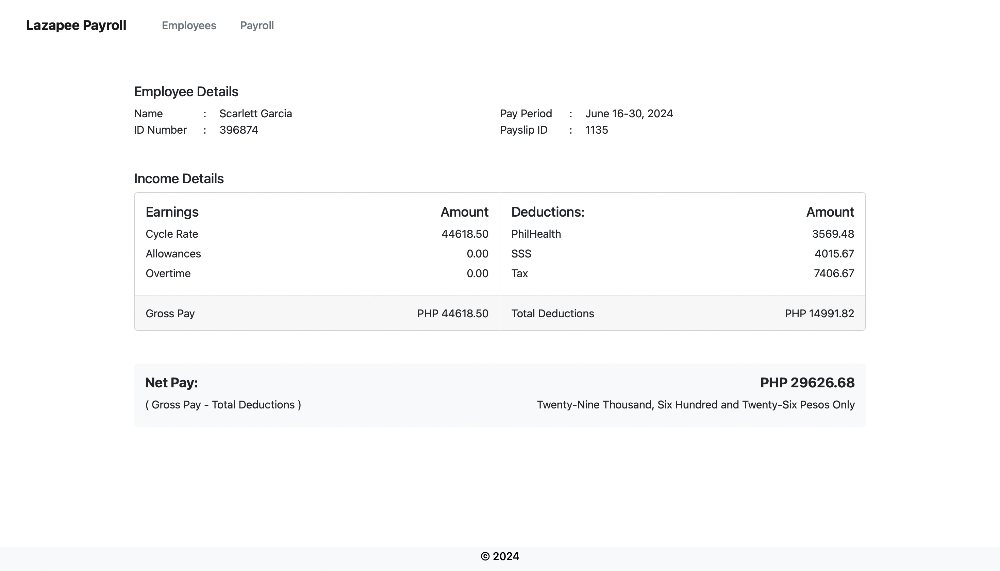

# Django Payroll System

## About the Project
### Overview
This is my final output for my Django course. The goal was to create a CRUD web app that has basic employee and payroll management functionalities. It includes specific calculations for Tax, Benefits, and Pay cycles.





### Built With
JQuery was used to handle AJAX interactions between frontend HTML files and backend Django views, enabling user interaction without necessarily doing a full page reload. 

Both jQuery and Bootstrap are included in the static directory


## How to Run
### Installation
Run the following in terminal:
1. ```git clone https://github.com/atkandi111/Lazapee-Payroll```
2. ```cd Lazapee-Payroll```
3. Create a virtual environment using ```python -m venv venv```
4. Activate virtual environment using ```source venv/bin/activate```
5. ```pip install -r requirements.txt```

### Running Server
1. Run ```python manage.py runserver``` in the same terminal window
2. Go to ```http://localhost:8000/``` in a web browser
